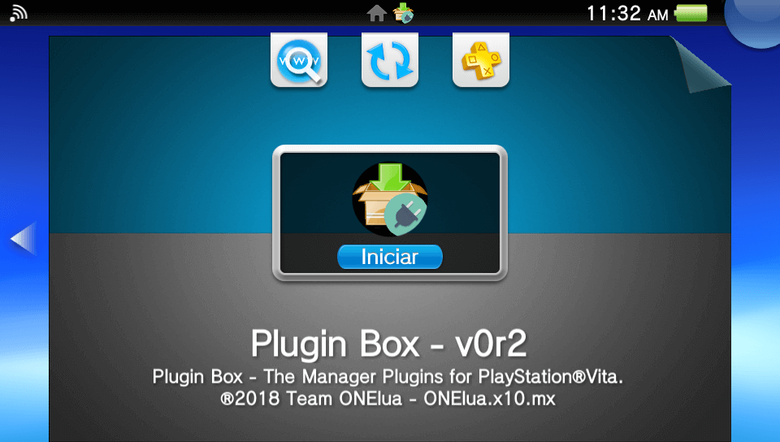
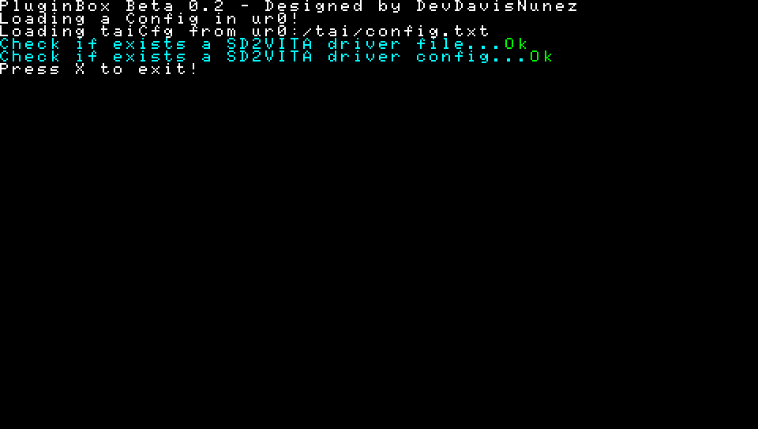

# PluginBox  

The Manager Plugins for PlayStation®Vita.

### Description ###
This useful application will allow you to Download, Install and Manage your plugins.

### Controls ###
- [cross]: Exit the application if everything ended successfully - Restart the console if it is the first installation.

### Changelog 0.2 ###
- Initial release POC.
- Install 'gamesd/sd2vita' Plugin.

### TO-DO ###
- Add support to more Plugins.
- Add more GUI.
- Add more stuff.
- Add a better icon!.

### Report bugs ###
if you see something wrong, please submit an issue or pull request.

### Credits ###
- The idea comes from my friend and coder, **Gdljjrod** [ToolBox](http://psp.scenebeta.com/noticia/toolbox).
- [*xyzz* and *The_Flow* for PS Vita gamecard to microSD adapter](https://github.com/xyzz/gamecard-microsd)
- **Team Molecule** for HENkaku and taihen.
- All people contributed creating Plugins.

### Donation ###
In case you want to support my work on the vita, you can always donate for some coffee. Any amount is highly appreciated:

